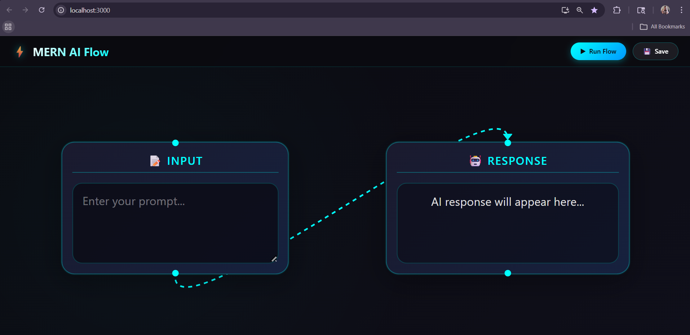

# MERN AI Flow App

## 📌 Project Overview
This is a simple AI-powered flow application built using the MERN stack and React Flow.  
Users can enter a prompt, execute the flow, view the AI-generated response, and save the data to MongoDB.

---

## 🚀 Features
- Interactive flow UI using React Flow
- Input node for user prompt
- Output node for AI response
- Integration with OpenRouter API (AI)
- Backend API using Node.js & Express
- MongoDB database to store prompt & response
- Save functionality

---

## 🛠️ Tech Stack
- Frontend: React, React Flow
- Backend: Node.js, Express.js
- Database: MongoDB Atlas
- API: OpenRouter (openai/gpt-3.5-turbo)

---

## ⚙️ Setup Instructions

### 1️⃣ Clone Repository
git clone https://github.com/Monalisa7077/MERN_AI_flow_app.git
cd MERN_AI_flow_app

---

### 2️⃣ Install Dependencies
cd backend
npm install

#### Frontend
cd frontend
npm install

---

### 3️⃣ Environment Variables

Create `.env` file in backend:
MONGO_URI=your_mongodb_connection_string
OPENROUTER_API_KEY=your_api_key

---

### 4️⃣ Run Application (Concurrently)
npm start

## 🧠 How It Works
1. User enters a prompt in the input node
2. Clicks "Run Flow"
3. Frontend sends request to backend
4. Backend calls OpenRouter API
5. AI response is returned and displayed
6. User clicks "Save"
7. Data is stored in MongoDB

####  screenshot of the application ####

